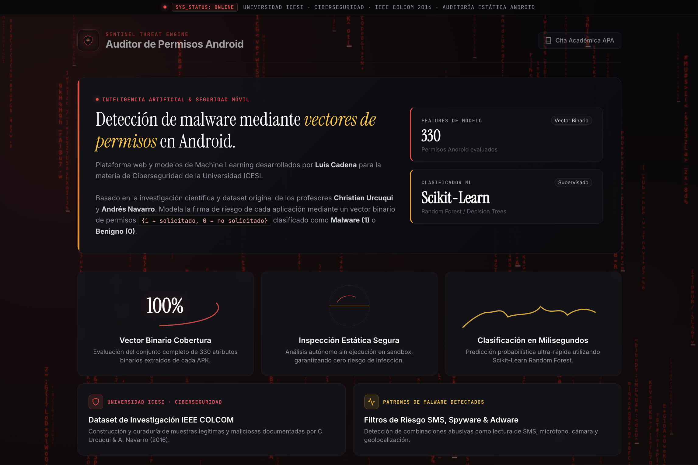
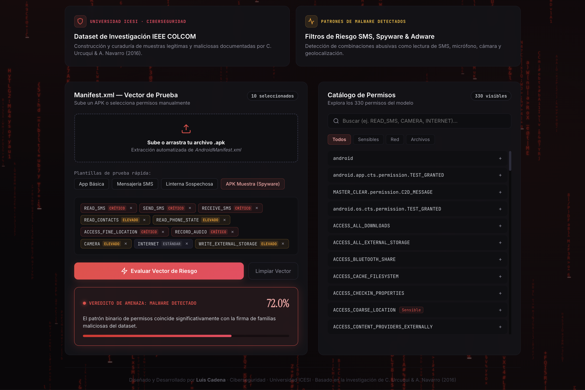

# Android Permission Sentinel

## Overview
Android Permission Sentinel is an end-to-end applied machine learning cybersecurity platform designed to analyze Android application manifest permissions and determine whether an APK exhibits benign or malicious behavior.

The system performs static manifest permission extraction and processes permission vectors through a trained Random Forest classification model to calculate risk probabilities.

Live Deployment: [android-permission-sentinel.vercel.app](https://android-permission-sentinel.vercel.app/)

---

## Interface Previews

### Dashboard and Analysis Overview


### Vector Assessment and Permission Inspector


---

## Core Capabilities
- Automated Static APK Parsing: Extraction of declared and requested permissions from uploaded APK files without executing binary code.
- Custom Vector Evaluation: Interactive permission selection and preset templates for simulating known application profiles.
- Machine Learning Risk Scoring: Inference pipeline delivering classification verdicts, benign confidence levels, and malware risk percentages.

---

## Technical Architecture
- Machine Learning Classifier: Scikit-learn Random Forest model trained on structured Android permission datasets, reaching a benchmark accuracy of 91.25 percent.
- Backend Application Programming Interface: High-performance asynchronous RESTful service implemented with FastAPI and Python.
- Frontend Client: Single-page application built with React, Vite, and custom user interface components.

---

## Project Structure
```text
.
├── backend/                  # RESTful API and serialized model artifacts
│   ├── main.py               # Application endpoints and inference logic
│   ├── malware_model.joblib  # Serialized Random Forest classifier
│   ├── model_features.joblib # Feature vector definitions
│   └── requirements.txt      # Python dependencies
├── frontend/                 # React and Vite client application
│   ├── src/                  # Application source code and components
│   ├── package.json          # Node.js dependencies and scripts
│   └── vite.config.js        # Build and development configuration
├── previews/                 # Interface screenshots and documentation assets
├── train.csv                 # Labeled Android permission dataset
├── train_model.py            # Training and model evaluation script
└── README.md                 # Project documentation
```

---

## Local Development and Deployment

### Prerequisites
- Python 3.9 or higher
- Node.js 18 or higher

### 1. Backend Service
```bash
python3 -m venv .venv
source .venv/bin/activate
pip install -r backend/requirements.txt
python3 train_model.py
cd backend
uvicorn main:app --reload --port 8000
```

### 2. Frontend Client
```bash
cd frontend
npm install
npm run dev
```

### 3. Environment Configuration
The frontend communicates with the backend through the following environment variable:
- `VITE_API_URL`: Target base URL for the backend API service. Defaults to `http://localhost:8000` during local execution.

